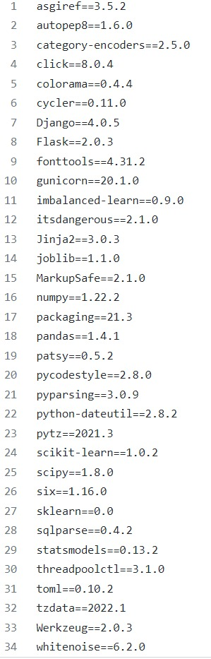

# prepayment-predicition-deploy-django

# TeamB_Model_Deployment
Predicting Mortgage Backed Securities Prepayment Risk Using Machine Learning

## Introduction
Mortgage-backed securities, called MBS, are bonds secured by home and other real estate loans. They are created when a number of these loans, usually with similar characteristics, are pooled together. As the borrowers gradually pay off the underlying mortgage loans, the investors receive payments of interest and principal. A large risk factor in MBS lies in the possibility of prepayments. Prepayments are payment by borrowers,who pay back a part, or the full amount of the loan earlier than discussed in their mortgage contract. The aim of our project is to develop various Machine Learning models that could predict the prepayment risk of mortgage loans by using machine learning techniques like Random Forest, Logistic Regression and Support Vector Machine (SVM) algorithms.

## Dataset
We use Freddie Mac’s home loans dataset. This dataset contains 291452 rows which represent the number of mortgages/ data points and 28 columns representing different features of the data.

## Important Features

*Credit Score:* - A number, prepared by third parties, summarizing the borrower’s creditworthiness, which may be indicative of the likelihood that the borrower will timely repay future obligations. Generally, the credit score disclosed is the score known at the time of acquisition and is the score used to originate the mortgage.

*MORTGAGE INSURANCE PERCENTAGE (MIP):* The percentage of loss coverage on the loan, at the time of Freddie Mac’s purchase of the mortgage loan that a mortgage insurer is providing to cover losses incurred as a result of a default on the loan.

*ORIGINAL COMBINED LOAN-TO-VALUE (OCLTV):* In the case of a purchase mortgage loan, the ratio is obtained by dividing the original mortgage loan amount on the note date plus any secondary mortgage loan amount disclosed by the Seller by the lesser of the mortgaged property’s appraised value on the note date or its purchase price.

*DEBT-TO-INCOME (DTI) RATIO:* Disclosure of the debt to income ratio is based on (1) the sum of the borrower's monthly debt payments, including monthly housing expenses that incorporate the mortgage payment the borrower is making at the time of the delivery of the mortgage loan to Freddie Mac, divided by (2) the total monthly income used to underwrite the loan as of the date of the origination of the such loan.

*LOAN-TO-VALUE (LTV):* In the case of a purchase mortgage loan, the ratio obtained by dividing the original mortgage loan amount on the note date by the lesser of the mortgaged property’s appraised value on the note date or its purchase price.

*PREPAYMENT PENALTY MORTGAGE (PPM):* - Denotes whether the mortgage is a PPM. A PPM is a mortgage with respect to which the borrower is, or at any time has been, obligated to pay a penalty in the event of certain repayments of principal.

*ORIGINAL LOAN TERM:* A calculation of the number of scheduled monthly payments of the mortgage based on the First Payment Date and Maturity Date.

*NUMBER OF BORROWERS:* The number of Borrower(s) who are obligated to repay the mortgage note secured by the mortgaged property.

#### Target Variable
Our Target variable is EverDelinquent

## Model Used:
This is a Classification problem so we use Random Forest Classifier and Linear Support Vector Classifier for Model Building.
### Training and Testing dataset
Split dataset into 80 % for Training and 20% for testing

#### We achieve 100% accuracy in both the models which indicates data leakage. This is due to sub duplicates in the dataset which cannot be solved unless we change the entire dataset.

**STEPS for web app development:**

**1.** Importing required Libraries and intialize the flask object.

**2.** Load pickle file for pipelined random forest model

**3.** We have created our web page using **HTML** and styling of web page using **CSS**.

**4.** Now , we have to join our HTML and CSS page with web app using Django **render(request, "home.html")**.

**5.** Now we take all the Inputs.

**6.** After getting all the inputs finally predict the output using **render(request, "result.html", {'prediction': prediction[0]})**.

## Requirement:

to run the file:

pip install -r requirements

change the current working directory to where the files are present.

py manage.py runserver

Deployment link: https://prepayment-prediction.herokuapp.com/

## Deploy Our Model Using Heroku Plateform:

**User Interface**

**Output:**

**Conclusion:**

Above the output predicted by our model is **There is a risk of prepayment** .
if there a prepayment risk for the loan then the model predicts **No risk of prepayment**.

**Browse link:**

App link - https://prepayment-prediction-b.herokuapp.com/
